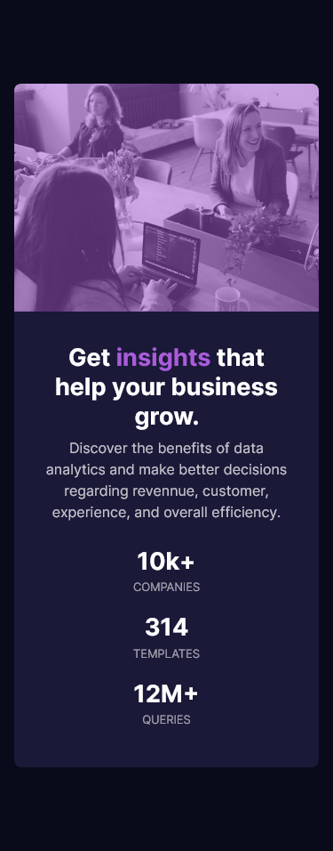

# Frontend Mentor - Stats preview card component solution

This is a solution to the [Stats preview card component challenge on Frontend Mentor](https://www.frontendmentor.io/challenges/stats-preview-card-component-8JqbgoU62)

## Table of contents

- [Overview](#overview)
  - [The challenge](#the-challenge)
  - [Screenshot](#screenshot)
  - [Links](#links)
- [My process](#my-process)
  - [Built with](#built-with)
  - [What I learned](#what-i-learned)
  - [Continued development](#continued-development)
- [Author](#author)

## Overview

### The challenge

Users should be able to:

- View the optimal layout depending on their device's screen size

### Screenshot

Mobile Version


Desktop Version


### Links

- Live Site URL: [Click Here](https://dharmik48.github.io/frontendmentor-challenge1-card/)

## My process

### Built with

- Semantic HTML5 markup
- CSS custom properties
- Flexbox
- CSS Grid
- Mobile-first workflow

### What I learned

Very Easy and short way to center a element in CSS!

```css
body {
  /* Make card center */
  display: grid;
  place-items: center;
}
```

### Continued development

The CSS variables are really usefull!! I'll be using them in every project.

```css
element {
  --variable-name: value;
}
```

Also the rem & em units are great help for responsive designs.

```css
element {
  property: 1rem;
}
```

## Author

- GitHub - [Dharmik48](https://github.com/Dharmik48)
- Frontend Mentor - [@Dharmik48](https://www.frontendmentor.io/profile/Dharmik48)
